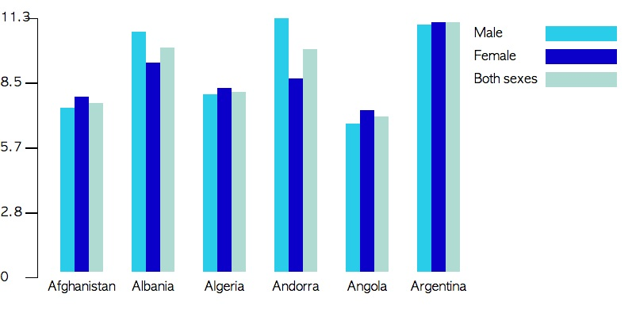
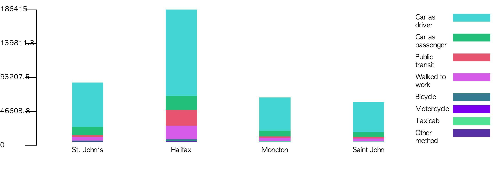

Jquery-Cool-Effects
===================
click below to see examples.
<table style="width:100%">
<h2>Graphs</h2>

<tr>
  <td>
  <a href="http://htmlpreview.github.io/?https://github.com/sth0728/Cool-Jquery-Effects/blob/master/clustered_column/clustered_column_sample.html">
   
  Clustered Column
  </a>
  </td>
  <td>
  <a href="http://htmlpreview.github.io/?https://github.com/sth0728/Jquery-Cool-Effects/blob/master/stacked_column/stacked_column_sample.html">
   
  Stacked Column
  </a>
  </td>
</tr>
</table>
===================
<h2>Effects</h2>
<table style="width:100%">
<tr>
  <td>
  <a href="http://htmlpreview.github.io/?https://github.com/sth0728/Cool-Juqery-Effects/blob/master/sperms/sperms_sample.html">
   
  Sperms
  </a>
  </td>
</tr>
</table>
===================
I am a student from University of Toronto, currently looking for a job. 
Please star this repository if you find the effects useful!  
Visit my personal website: http://www.taihwa.net
